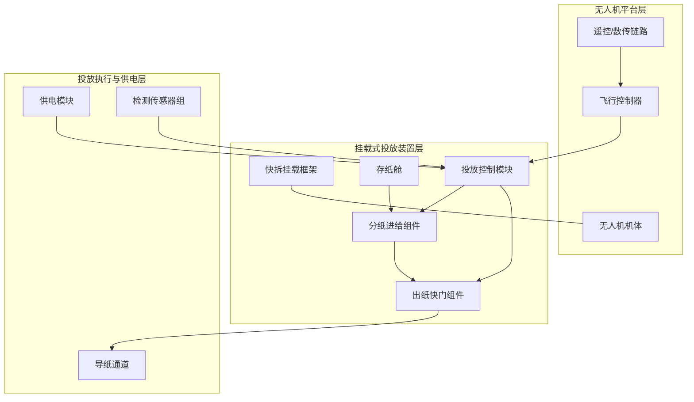
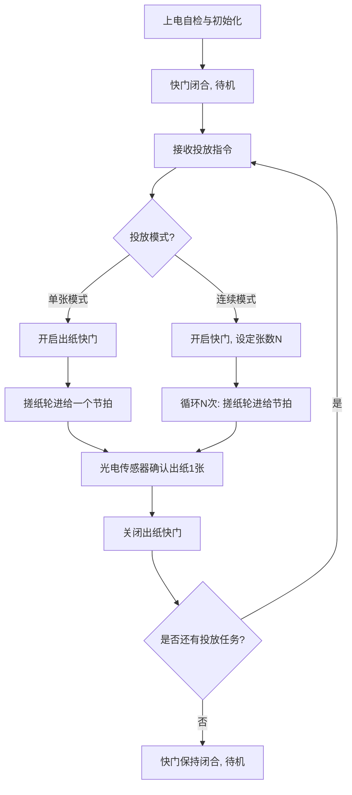

# 技术交底书

**案件名称**：一种无人机挂载式单张传单分离投放装置及其控制方法

**技术联系人**：
- 姓名：[待填写]
- 电话：[待填写]
- 邮箱：[待填写]

**专利类型**：发明

---

## 注意事项

（1）交底书应使代理人能看懂，尤其是背景技术和详细技术方案，一定要写得全面、清楚、完整；
（2）技术的公开程度，应以本领域普通技术人员不需付出创造性劳动即可进行实施为准。
（3）在与代理人沟通时，对于代理人咨询的技术问题，应给予回答并认真讲解，并且按要求及时正确地补充相应技术材料。

---

## 一、介绍相关技术背景，描述与本发明技术最相近的现有技术，并说明该现有技术存在的缺点

### 1.1 现有技术

**检索说明**：在国家知识产权局专利公布公告系统及 Google Patents 中，以「无人机 挂载 传单 抛撒」「无人机 宣传单 撒播」「无人机 纸张 投放」「搓纸 分纸 单张投放」等为检索词进行检索；部分条目的公开文本与著录项以 Google Patents 页面复核。

按技术方向分类列举如下。

#### 方向一：舱盖式批次抛撒装置

**CN106347664A（一种多旋翼无人机用的宣传单撒播装置及其使用方法）**

该专利公开一种多旋翼无人机用的宣传单撒播装置，包括顶板、舱体、舵机、舵盘、若干舱盖与连杆；宣传单置于舱体内，顶板罩于舱体上并固定于无人机底部，舵机通过舵盘与连杆控制各舱盖的开合。其通过分舱开盖实现多点撒播，一次装载可在多个不同地点进行宣传单的空中撒播，无需每次撒播后回收重新装填。

- **应用场景**：多旋翼无人机低空批量纸页撒播。
- **局限性**：按舱成批开盖抛撒，无法对单张纸页进行精确投放；舱盖打开后成叠纸张直接暴露于旋翼下洗气流中，落点分散、漂移明显；无出纸计数与投放闭环控制。

**来源链接**：https://patents.google.com/patent/CN106347664A/zh

#### 方向二：搓纸轮大容量连续抛撒装置

**CN118419262A（一种无人机大容量纸张抛撒器）**

该专利公开一种无人机大容量纸张抛撒器，包括滑轨、后板、压纸组件与底部支撑组件，压纸组件与滑轨滑动连接并与后板、底部支撑组件围成容纳斜摞纸的腔体；压纸组件下方设有由电机驱动的高速搓纸轮，通过重力将斜摞纸压紧，搓纸轮将纸张依次抛出，并设有斜导板及弧形导纸面改变抛撒方向、防止纸张上抛与折叠。

- **应用场景**：大载重无人机的大容量快速纸张抛撒。
- **局限性**：面向大容量连续抛撒场景，结构较复杂、重量较大；出纸口无主动遮蔽机构，飞行与待机过程中纸张持续暴露于气流；以连续抛出为主，缺乏逐张投放与落点控制，且未给出与飞控联动的投放时序控制方法。

**来源链接**：https://patents.google.com/patent/CN118419262A/zh

#### 方向三：单页投放装置（最接近现有技术）

**CN219154755U（一种含有宣传页投放装置的无人机）**

该专利公开一种含有宣传页投放装置的无人机，无人机下侧面通过快拆接头连接宣传页投放装置，装置包括壳体、供纸装置与投纸装置；供纸装置中托纸板的进纸端铰接于壳体内，出纸端下侧设有弹性件与装纸开关；投纸装置包括位于护盖内的投放控制电路模块、搓纸电机、减速机与搓纸轮，搓纸轮下侧贴合托纸板出纸端上侧与分纸器内侧，光电传感器连接投放控制电路模块输入端。其通过分纸器与搓纸轮实现单页分离，防止大量单页集中投放造成浪费，并防止纸张干扰无人机正常飞行。

- **应用场景**：无人机单页纸页投放，防止集中投放浪费。
- **局限性**：虽具备分纸器与光电传感器，但其目标为「防止集中投放浪费」，出纸口并无主动启闭的快门机构，巡航与转向过程中出纸口仍可能使纸张受气流扰动；未涉及利用旋翼下洗流进行落点导向的结构设计；未给出面向定点单张投放、连续投放及与飞控联动作业的多模式投放时序控制方法；也未给出适配不同机型（中型多旋翼）的快拆挂载与重心配平、供电方案的完整设计。

**来源链接**：https://patents.google.com/patent/CN219154755U/zh

**检索总结**：现有技术覆盖了舱盖式批次抛撒、搓纸轮大容量连续抛撒以及单页投放装置三个方向。其中单页投放装置与本方案最为接近，但普遍存在以下共同取向：以「批量抛撒、防止浪费」为目标，缺乏对**单张精确投放、落点漂移抑制、巡航遮蔽、多模式投放时序控制**的系统性设计。

**本发明与现有技术的本质区别**：本发明将「单张分纸进给 + 主动出纸快门 + 下洗流导向通道 + 遥控/飞控联动多模式投放时序控制」有机结合，实现单张纸页的精确分离与定点投放，抑制旋翼下洗流造成的落点漂移，并在巡航与待机状态下以快门遮蔽出纸口、防止纸张被气流卷出或干扰飞行。

### 1.2 现有技术存在的缺点

（1）舱盖式批次抛撒装置按舱成批开盖抛撒，无法单张投放，落点分散、不可控；

（2）纸张质量轻，从出纸口抛出后受旋翼下洗流及高空侧风影响产生随机漂移，定点投放精度差；

（3）现有装置的出纸口在巡航与待机状态下无主动遮蔽，纸张易被气流卷出、受潮或粘连，甚至卷入旋翼影响飞行安全；

（4）缺乏按投放点逐一投放的时序控制：无法实现「投放一张 → 关闭 → 飞抵下一目标点 → 再投放一张」的作业模式，难以满足多点位精准投放需求；

（5）供电、遥控与飞控联动方案不明确，改装适配不同机型的通用性与可维护性差。

---

## 二、针对上述缺点，说明本发明所要解决的技术问题

针对上述现有技术缺陷，本发明要解决以下技术问题：

（1）实现纸页的**单张精确分离与投放**，避免批次成叠抛出导致的落点分散；

（2）抑制旋翼**下洗流与侧风**造成的纸张漂移，提高定点投放精度；

（3）在巡航与待机状态下**遮蔽出纸口**，防止纸张被气流卷出、受潮或干扰飞行安全；

（4）提供**多模式投放时序控制方法**，支持单张投放、连续多张投放以及与飞控联动的按点作业，实现「投放一张 → 关闭 → 飞抵下一目标 → 再投放」的作业流程；

（5）提供**通用快拆挂载与供电方案**，使装置可适配中型多旋翼无人机而不改动无人机本体结构。

---

## 三、本发明技术方案的详细阐述

### 3.1 背景

本方案应用于某型中型多旋翼无人机平台的纸页定点投放场景。无人机通过底部挂载接口挂接投放装置，在遥控或航线飞行状态下，按作业指令在指定目标点上空投放单张或指定数量的纸页。

针对现有技术落点分散、单张不可控、出纸口无遮蔽、缺乏多点位逐张作业能力等缺陷，本发明提供一种「分纸进给 + 主动快门 + 下洗流导向 + 多模式时序控制」相结合的挂载式单张纸页分离投放装置及其控制方法。

前提条件：所投放纸页为标准纸质印刷品，具有可分离的单页厚度与一定挺度；无人机具备至少一个底部挂载接口及遥控链路（或数传链路）。

### 3.2 系统框图

系统划分为无人机平台、挂载式投放装置、投放执行与供电三层，层次关系如下：

### 3.3 模块功能说明

- **快拆挂载框架**：将投放装置整体连接于无人机底部挂载接口，实现快速装拆与重心配平；框架两侧设有快拆卡扣与防转销，保证飞行中装置不晃动、不偏转。
- **存纸舱**：容纳斜置纸垛，通过压纸弹簧向出纸方向施加压紧力，保证搓纸轮与最上层纸张保持稳定接触；舱壁设有观察窗与装纸门，便于装填与余量观察。
- **分纸进给组件**：由搓纸轮、分纸舌与压纸弹簧构成。搓纸轮转动时利用摩擦将最上层单页送入出纸口，分纸舌以略大于单纸厚的间隙阻挡下方纸张随动，实现单张分离进给。
- **出纸快门组件**：设于出纸口，由舵机（或直线舵机）驱动的挡板构成，常态闭合以遮蔽纸张；投放时按控制时序开启，投毕随即闭合。快门开度可调，用于适配不同投放节拍与下洗流条件。
- **投放控制模块**：以微控制器为核心，接收遥控/数传链路或飞控联动信号，解析投放模式与张数，按预设时序驱动搓纸电机与快门舵机；采集光电传感器、行程开关与舱门到位信号，实现出纸计数、到位确认与故障保护。
- **导纸通道**：设置于出纸口下方，通道出口朝向斜下方且与机身轴线成预设夹角，使抛出的纸张切入旋翼下洗流场，借助下洗气流将纸张压向地面并减小水平漂移。
- **检测传感器组**：包括出纸口光电传感器（计数并判断是否有纸）、快门位置传感器（到位反馈）、装纸门状态开关，为控制模块提供闭环反馈。
- **供电模块**：支持两种供电方式——由无人机机载电源经稳压电路取电，或采用独立锂聚合物电池组供电；两种方式通过拨动开关/跳线选择，互不冲突。

### 3.4 系统流程说明

#### 流程图

#### 流程说明

（1）装置上电后执行自检，确认快门闭合、存纸舱有纸、传感器正常后进入待机；

（2）操作端通过遥控通道或数传链路发送投放指令（含模式与张数），或由飞控在到达目标点悬停/低速段时触发联动投放；

（3）控制模块先开启出纸快门，随后驱动搓纸轮按节拍进给：单张模式仅进给一个节拍即送出 1 张；连续模式按设定张数循环进给 N 次；

（4）出纸口光电传感器对每张出纸进行计数确认，防止空转或连张；

（5）投放完成（或达到设定张数）后，控制模块关闭快门，使装置恢复遮蔽状态，等待下一投放指令。

### 3.4.1 符号与公式

#### （1）符号与变量定义

| 符号 | 含义 | 量纲/取值范围 |
|------|------|---------------|
| \(d\) | 单页传单纸厚 | mm，一般 0.10–0.15 mm |
| \(h\) | 分纸舌与搓纸轮之间的过纸间隙 | mm，\(d \leq h \leq 1.5d\) |
| \(r\) | 搓纸轮半径 | mm，一般 10–15 mm |
| \(\omega\) | 搓纸轮角速度 | rad/s，可调 |
| \(n\) | 搓纸轮转速 | r/min，\(n=60\omega/(2\pi)\)，一般 60–300 |
| \(v\) | 搓纸轮线速度 | mm/s，\(v=\omega r\) |
| \(L_f\) | 单次进给的纸张输送距离 | mm，约等于单页纸长 |
| \(t_f\) | 单张进给时间 | s，一张纸通过搓纸轮的时间 |
| \(t_o\) | 出纸快门开启时间 | s，一般 0.3–0.5 s |
| \(t_c\) | 出纸快门关闭时间 | s，一般 0.3–0.5 s |
| \(T_p\) | 单次投放节拍 | s，\(T_p=t_o+t_f+t_c\) |
| \(N\) | 连续模式投放张数 | 正整数，遥控设定 |
| \(N_{\max}\) | 存纸舱最大存纸量 | 张，一般 100–300 |
| \(H\) | 投放高度（相对地面） | m |
| \(u_d\) | 下洗流水平分量速度 | m/s |
| \(v_z\) | 纸张下落速度（稳态） | m/s |
| \(s\) | 理论落点漂移距离 | m，\(s=(u_d H)/v_z\) |
| \(V_s\) | 供电电压 | V，5 或 12 |
| \(m\) | 装置单机质量 | kg，一般 ≤ 2 |

#### （2）核心公式

搓纸轮线速度：

\[ v = \omega r \tag{1} \]

单张分离判据——过纸间隙应不小于单纸厚、且小于两倍纸厚，保证分纸舌仅放行最上层单页：

\[ d \leq h \leq 1.5d \tag{2} \]

单次投放节拍：

\[ T_p = t_o + t_f + t_c \tag{3} \]

连续模式 \(N\) 张总耗时：

\[ T_N = t_o + N\,t_f + t_c \tag{4} \]

落点漂移估算：

\[ s = \frac{u_d H}{v_z} \tag{5} \]

式中各符号含义见上表。式 (5) 用于评估下洗流与高度对落点的影响，指导快门开启时机与投放高度的选取。

### 3.5 关键技术参数

| 参数 | 符号 | 典型值/范围 |
|------|------|-------------|
| 单页纸厚 | \(d\) | 0.10–0.15 mm |
| 过纸间隙 | \(h\) | \(d\)–1.5\(d\) |
| 搓纸轮半径 | \(r\) | 10–15 mm |
| 搓纸轮转速 | \(n\) | 60–300 r/min |
| 快门开启时间 | \(t_o\) | 0.3–0.5 s |
| 快门关闭时间 | \(t_c\) | 0.3–0.5 s |
| 存纸量 | \(N_{max}\) | 100–300 张 |
| 供电电压 | \(V_s\) | 5 V / 12 V |
| 控制接口 | — | PWM / SBUS / 串口 |
| 单机质量 | \(m\) | ≤ 2 kg |
| 投放高度 | \(H\) | 10–50 m |

---

## 四、与现有技术相比，本发明具有哪些优点？

（1）**单张精确投放**：通过分纸舌与搓纸轮的单张分离，结合出纸计数，实现逐张投放，落点可控；

（2）**落点漂移抑制**：导纸通道将纸张切入旋翼下洗流场，借助下洗气流压制纸张并减小水平漂移，提高定点投放精度；

（3）**巡航遮蔽与飞行安全**：出纸快门常态闭合，巡航与待机时纸张不暴露于气流，避免纸张被卷出、受潮或卷入旋翼，提升飞行安全性；

（4）**多模式作业能力**：支持单张、连续多张及与飞控联动的按点作业，满足「投放一张 → 关闭 → 飞抵下一目标 → 再投放」的多点位作业流程；

（5）**通用性与可维护性**：快拆挂载、双供电方案与标准化控制接口，使装置可便捷适配中型多旋翼无人机，便于装填、维护与快速转场。

---

## 五、本发明的技术关键点和欲保护点是什么？

（1）**单张分纸进给结构**：由搓纸轮、分纸舌与压纸弹簧构成的分纸进给组件，过纸间隙满足 \(d \leq h \leq 1.5d\)，实现单张分离输送（具体实现见 3.3、3.4.1）；

（2）**主动出纸快门及其时序控制**：出纸口常态闭合的主动快门，以及「开快门 → 搓纸进给 → 出纸计数 → 关快门」的投放时序控制方法（具体实现见 3.3、3.4）；

（3）**下洗流导向结构**：导纸通道出口朝向与机身轴线成预设夹角，使纸张切入下洗流场以减小漂移的导向设计（具体实现见 3.3、3.4.1 式 (5)）；

（4）**多模式投放控制方法**：单张模式、连续模式及飞控联动作业模式的指令解析与执行流程（具体实现见 3.4 流程图）；

（5）**快拆挂载与双供电方案**：快拆卡扣、防转销、重心配平结构及机载取电/独立电池双供电选择方案（具体实现见 3.3）。

---

## 六、其它

### 实施例

**实施例 1：单张定点投放**

在某中型多旋翼无人机下方通过快拆挂载框架安装本装置，存纸舱装入 A4 纸页约 150 张。无人机飞行至目标点上空约 20 m 高度悬停，操作手通过遥控通道发送「单张投放」指令：控制模块开启出纸快门（约 0.4 s），搓纸轮以一个进给节拍送出 1 张，光电传感器确认出纸后关闭快门。纸张经导纸通道切入下洗流场垂直下坠，落点相对目标点偏差明显小于现有舱盖式抛撒方式。

**实施例 2：连续多张投放**

在需要在一处连续投放多张的场合，操作手设定张数 \(N=10\)。控制模块开启快门后，按节拍循环进给 10 次，每张经光电传感器计数确认，投毕关闭快门。试验表明连续投放不出现连张、卡纸，投放张数准确。

**实施例 3：与飞控联动作业**

将投放控制模块与飞控联动：无人机按航线飞抵每个预设目标点时自动悬停，飞控向投放模块输出触发信号，模块执行单张投放后返回就绪，无人机继续飞往下一目标点，实现「投放一张 → 关闭 → 飞抵下一目标 → 再投放」的多点位自动作业。

### 技术效果

本装置可实现单张纸页的精确分离与定点投放；下洗流导向结构使落点漂移显著减小；主动快门保证了巡航与待机状态下的遮蔽与飞行安全；多模式控制方法支持单张、连续与联动作业，作业效率与灵活性明显优于现有舱盖式与连续抛撒式装置。

### 参数设置示例

上述典型参数（纸厚范围、搓纸轮尺寸与转速、快门时间、存纸量、供电电压等）仅为示例性说明，不作为本发明的权利要求限制。
